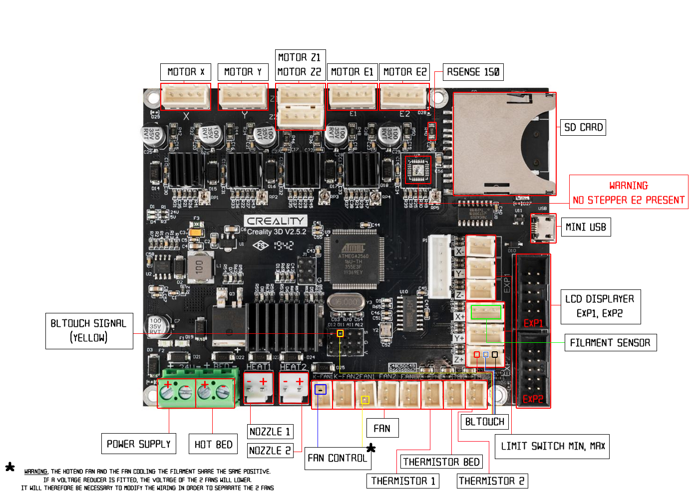

# gtst-3dprinter
Reparos realizados na impressora 3D Creality CR-10 com motherboard queimada

- Proprietário: Gabriel TST
- Modelo: Creality CR-10 V2
- Motherboard: Creality 3D V2.5.2
- Defeito: Entrada termistor TB queimada (curto 0V)


# Firmware

- Gerado com PlatformIO 6.1.19
- [Marlin](https://github.com/MarlinFirmware) v2.1.2.5
- Configuration-release-2.1.2.5 Creality CR-10 V2

Modificações:
- TEMP_BED_PIN alterado para 15 em src/pins/ramps/pins_RAMPS.h
- Desabilitado BLTouch

```c
//
// Temperature Sensors
//
#ifndef TEMP_0_PIN
  #define TEMP_0_PIN                          13  // Analog Input
#endif
#ifndef TEMP_1_PIN
  #define TEMP_1_PIN                          14  // Analog Input
#endif
#ifndef TEMP_BED_PIN
  #define TEMP_BED_PIN                        15  // Analog Input
#endif
```

# Motherboard



Removidos C50 e R48 da entrada do termistor da mesa (TB). Identificado curto com GND. Provável queima do pino do ADC do ATMEGA2560 - Pin 83 - PK6 (ADC14).

Após remapemento do ADC, a entreda do Termistor 2 (TH2) está sendo utilizada para o monitoramento de temperatura da mesa.